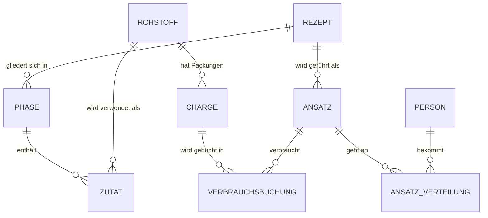

# Datenmodell für eine Kosmetik-Rohstoffverwaltung

Stand: 02.10.2026 · Schnappschuss, ohne Support, ohne Gewähr

Dieses Dokument beschreibt das Datenmodell, mit dem ich beim Rühren von Naturkosmetik meine Rohstoffe, Rezepte und Ansätze verwalte. Es ist als Anschauungsbeispiel gedacht: Wie kann man das Ganze strukturieren, und warum so?

**Hinweis:** Das Modell ist in der Praxis gewachsen und wird weiterentwickelt. Dieser Text ist ein Schnappschuss und wird nicht laufend gepflegt. Es gibt keinen Support. Gebaut habe ich es zusammen mit einer KI. Ich habe die Anforderungen an Datenstruktur und Abläufe vorgegeben, die Umsetzung war Ping-Pong zwischen mir und der KI. Die produktive Variante läuft in einer Weboberfläche für Datenbanken. Die SQL-Skizze (`schema.sql`) ist eine vereinfachte Übersetzung und nicht gegen eine echte Datenbank getestet.

## Die vier Grundideen

1. **Rohstoff und Charge trennen.** "Sheabutter" ist ein Rohstoff (Name, INCI, Funktion, Dosierung). Jede gekaufte Packung davon ist eine eigene **Charge** (MHD, Lagerplatz, Restmenge). Ein Rohstoff hat viele Chargen.
2. **Rezept und Ansatz trennen.** Das **Rezept** ist die Vorlage in Prozent. Der **Ansatz** ist ein bestimmtes Mal Rühren, mit Datum, Batchgröße und eigener Chargennummer.
3. **Die Verbrauchsbuchung als Brücke.** "Für Ansatz X wurden 12,5 g aus Charge Y verbraucht." So weiß man später genau, welche Packung in welcher Creme steckt.
4. **Berechnen statt speichern.** Was sich ausrechnen lässt (Gesamtbestand eines Rohstoffs, kritisches Verbrauchsdatum, "reif ab", Summe der Prozente im Rezept), wird nicht gespeichert, sondern abgefragt.

## Die Beziehungen

Lesehilfe: Ein Strich mit "||" auf der einen und "o{" auf der anderen Seite bedeutet "eins zu viele" (ein Rohstoff hat viele Chargen). Die Ansatz-Verteilung verbindet Ansätze und Personen und trägt das Feedback.

Dazu kommen kleine Zusatztabellen: Fettsäureprofile (mehrere Rohstoffe können auf dasselbe Profil zeigen), Rohstoff-Aliase (Synonyme und Markennamen), Einkaufsliste und Verpackungen.

## Die Tabellen mit den wichtigsten Feldern

| Tabelle | Wichtigste Felder |
|---|---|
| Rohstoffe | Name, INCI, Kategorie, Ölgruppe, Dichte, Haltbarkeit nach Öffnung (Monate), Funktionsnotiz, Mindestbestand |
| Rohstoff-Chargen | → Rohstoff, Packungsgröße, Bestand, Einheit (g/ml), MHD, geöffnet am, Lagerplatz, Händler-Chargennummer, Status (aktiv / leer-ausgebucht / verworfen) |
| Rezepte | Name, Version, Status, Produkttyp, Haltbarkeit, Reifezeit (Wochen), Quelle, Beschreibung |
| Rezept-Phasen | → Rezept, Reihenfolge, Phasenname, Temperatur-Hinweis, Arbeitsschritt-Text |
| Rezept-Zutaten | → Phase, → Rohstoff, Menge in %, Mengenhinweis ("ca.", "q.s.") |
| Ansätze | → Rezept, Datum gerührt, Batchgröße, Chargennummer, Status |
| Verbrauchsbuchung | → Ansatz, → Charge, Menge verbraucht (g) |
| Ansatz-Verteilung | → Ansatz, → Person, Notiz, Feedback |
| Personen | Kürzel und was für die Rezeptwahl relevant ist (z. B. Hauttyp, Unverträglichkeiten) |

## Entwurfsentscheidungen

- **Rezepte in Prozent, die Batchgröße gehört zum Ansatz.** Dasselbe Rezept lässt sich in 30 g oder 200 g rühren, ohne es zu kopieren.
- **Alles in Gramm.** Eine Packung darf in ml angegeben sein. Für den Bestand rechnet die Datenbank über die Dichte in Gramm um. Sonst addiert man am Ende Äpfel und Birnen.
- **Nichts löschen, sondern Status setzen.** Eine leere Charge bekommt "leer-ausgebucht" und Bestand 0, sonst fehlt später die Spur.
- **Die Verarbeitung gehört zur Phase, nicht zum Rohstoff.** Dieselbe Butter wird in einem Rezept geschmolzen, im nächsten kalt eingerührt.
- **Selbst Hergestelltes (Mazerate, Hydrolate) wird wieder zum Rohstoff mit eigener Charge.** So reicht die Rückverfolgung bis zum Ausgangsrohstoff.
- **Rezept-Version als eigene Zeile.** Statt ein Rezept zu überschreiben, wird eine neue Version angelegt und die aktuelle markiert. So sieht man, was sich wann und warum geändert hat.
- **Verpackungen waren zuerst bewusst unverknüpft.** Zu Beginn war nicht klar, wie sie gebraucht werden, also erst eine einfache Liste. Inzwischen hat jede Verpackung eine optionale Verknüpfung zur passenden Etikettenvorlage; Verknüpfen kann man später immer noch.

## Was die Skripte tun (ohne Code)

Die Skripte sind in Python geschrieben, die Logik funktioniert aber in jeder Sprache. Sie liegen nicht in diesem Repo, die Beschreibung soll nur zeigen, was sich aus dem Datenmodell herausholen lässt.

- **Verbrauch abbuchen.** Nach dem Rühren wird der Ansatz bestätigt. Das Skript zeigt zuerst einen Plan, welche Charge wie viel abgibt: zuerst eine bereits angebrochene Packung, sonst die mit dem frühesten MHD, Chargen ohne MHD kommen ans Ende und werden markiert. Einzelne Chargen kann man von Hand überschreiben. Erst nach der Bestätigung wird gebucht, in einem Schritt: Verbrauchsbuchungen anlegen, Bestand senken, leere Chargen auf "leer-ausgebucht" mit Bestand 0 setzen, Ansatz auf "Erfolgreich gerührt" setzen. Reicht der Bestand für eine Zutat nicht, wird für sie nichts gebucht, die Lücke bleibt sichtbar. Ein Ansatz kann nicht doppelt gebucht werden.
- **Rührzettel erzeugen.** Aus Rezept und gewünschter Batchgröße in Gramm entsteht eine druckbare Seite: Zutaten nach Phasen, Mengen in Gramm, dazu Lagerplatz und Chargennummer der Packung, die genommen werden soll (nach derselben Regel wie beim Abbuchen). Links gibt es eine Checkbox zum Abhaken.
- **Etiketten erzeugen.** Aus dem Rezept werden Etiketten mit Namen und Zutatenliste für die fertigen Gebinde gedruckt.

## Für den Einstieg

Wer so etwas nachbauen will, fängt am besten mit den sieben Kerntabellen aus [`schema.sql`](schema.sql) an (Rohstoff, Charge, Rezept, Phase, Zutat, Ansatz, Verbrauchsbuchung) und lässt alles andere weg. Ein guter erster Test ist die Frage: "Wie viel Sheabutter habe ich insgesamt?" Das ist eine einzige Abfrage über die Chargen (siehe die View `rohstoff_bestand`).

## Falls du NocoDB nutzt

Die produktive Variante läuft in NocoDB. Dort gibt es eine eigene Dokumentation, die ich nicht nachbaue: https://nocodb.com/docs/product

Zur Orientierung:
- Die Beziehungen aus dem Diagramm sind dort **Link-Felder** (eins zu viele, viele zu eins, viele zu viele). Berechnetes wie der Gesamtbestand ist ein **Rollup**, **Lookup** oder **Formelfeld**.
- NocoDB steht in den aktuellen Versionen unter der "Sustainable Use License" (Stand der Lizenzdatei: 29.01.2026), also nicht unter einer Open-Source-Lizenz im strengen Sinn. Die private Nutzung ist erlaubt. Den Lizenztext findest du im NocoDB-Repo.
- Stand 02.10.2026 gibt es bei einer MariaDB als Unterbau einen bekannten Fehler beim Löschen und Ändern **über die REST-API** in Tabellen mit Link-, Lookup- oder Rollup-Feldern (die NocoDB-Oberfläche ist nach meinen Tests nicht betroffen): https://github.com/nocodb/nocodb/issues/14035

## Was hier nicht steht

Keine Rezepte und Rohstoffdaten, keine Skripte, keine Personendaten. Das Ölmodell (Ölgruppen) und die Bücher und Rezepte von Heike Käser (Olionatura) sind urheberrechtlich geschützt und für den privaten Gebrauch bestimmt. Dieses Repo enthält nichts daraus. Die MIT-Lizenz gilt nur für die hier enthaltenen eigenen Texte und die SQL-Skizze.

## Lizenz

MIT, siehe [`LICENSE`](LICENSE).
